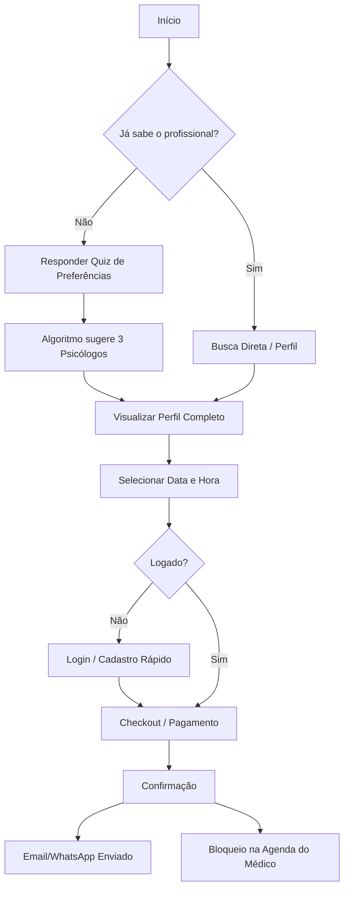
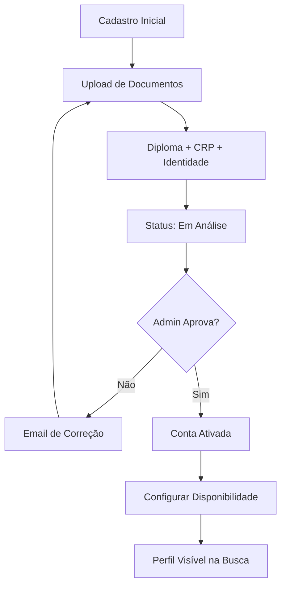
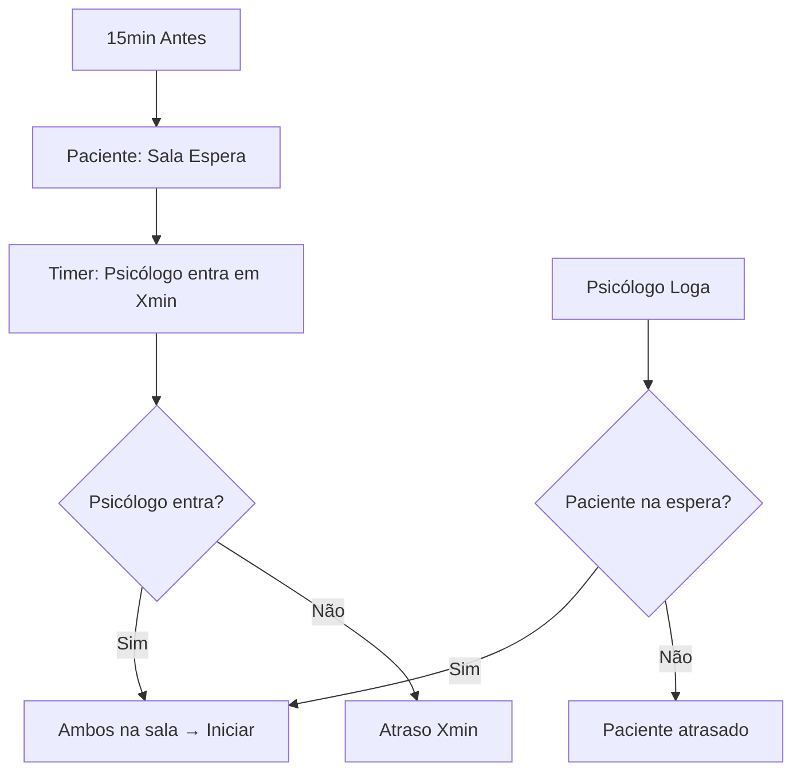

# Zenklub CO - Telemedicine Platform Masterplan v2.0

## 1. Visão Executiva e Estratégia

### 1.1. Visão do Produto
Criar o ecossistema de saúde mental definitivo para a América Latina. Não apenas um app de agendamento, mas uma plataforma completa de gestão de bem-estar que integra pacientes, profissionais de saúde e empresas financiadoras.

### 1.2. Diferenciais Competitivos (Baseado no Design)
*   **Matching Inteligente:** Uso de questionário de preferências (`questionário_de_preferências`) para conectar o paciente ao terapeuta ideal, não apenas uma lista fria.
*   **Ecossistema B2B:** Portal dedicado para empresas gerenciarem a saúde mental dos colaboradores (`dashboard_da_empresa`), criando um canal de receita recorrente (B2B2C).
*   **Gestão Clínica Completa:** O psicólogo não apenas atende, mas gere sua carreira (Financeiro, Prontuário, Agenda) dentro da plataforma.

### 1.3. Regras de Negócio Críticas (Audit)
*   **Política de Cancelamento:** Grátis até 24h antes. 50% de multa se cancelado com <24h.
*   **Reagendamento:** Prioridade para mesmo psicólogo ou próximo slot livre.
*   **Sessão & Atrasos:** Sala de espera com timer (15min antes). Tolerância de atraso de 5min para psicólogo.
*   **Cotas B2B:** Controle estrito de sessões por funcionário (ex: 8/12 utilizadas) com alertas de consumo.

---

## 2. Arquitetura Técnica (Scalable Stack)

### 2.1. Core Stack
*   **Frontend:** **Next.js 14+ (App Router)** - *Performance e SEO.*
*   **Linguagem:** **TypeScript** - *Segurança e Manutenibilidade.*
*   **Estilização:** **Tailwind CSS** + **Shadcn/UI** - *Velocidade e Consistência Visual.*
    *   *Estados Críticos:* Loading (Skeletons), Error ("Sem terapeutas"), Empty ("Nenhum agendamento"), Success (Confetti).
    *   *Breakpoints:* Mobile (375px - 1 col), Tablet (768px - 2 col), Desktop (1024px - 3 col).
*   **Backend/DB:** **Supabase** (PostgreSQL + Auth + Realtime).
*   **Data Access:** **Supabase-js** (Direct PostgREST) - *Zero overhead, sem ORM lock-in.*
*   **Caching/Edge:** **TanStack Query** + **Cloudflare** (Cache hit 90%).

### 2.2. Integrações Chave
*   **Vídeo:** **Daily.co** (CDN Latam Nativo, <100ms latência, Custo otimizado).
*   **Pagamentos:** **Stripe Connect** (Split de pagamentos automático entre Plataforma/Psicólogo).
*   **Comunicação:** **WhatsApp Business API** (Meta) + **OneSignal** (Web Push Grátis). SMS apenas fallback.
*   **Agendamento:** Lógica customizada no Postgres (prevenção de double-booking).

### 2.3. Segurança, Compliance e Qualidade
*   **LGPD & Dados Sensíveis:** Conformidade rigorosa com a Lei Geral de Proteção de Dados. Dados de saúde (prontuários) criptografados no banco (Encryption at Rest) e em trânsito. Logs de auditoria imutáveis para acesso a dados de pacientes.
*   **Acessibilidade (WCAG 2.1 AA):** Interface inclusiva com alto contraste, suporte a leitores de tela e navegação por teclado. Saúde mental é para todos.
*   **Estratégia PWA (Progressive Web App):** A aplicação será instalável em dispositivos móveis, permitindo acesso offline básico e notificações push nativas, sem a barreira de download nas lojas de apps na fase inicial.

---

## 3. Sitemap Completo e Estrutura de Navegação

Baseado na análise dos arquivos de design (`stitch_landing_page...`), a plataforma possui 4 portais distintos.

### 3.1. Portal Público & Onboarding (Marketing)
*   `/` **Home** (Landing Page com Hero, Prova Social, CTAs)
*   `/sobre` **Sobre Nós**
*   `/para-empresas` **Landing Page B2B** (Lead Gen)
*   `/para-psicologos` **Landing Page Profissionais** (Benefícios)
*   `/busca` **Diretório de Profissionais** (Filtros avançados)
*   `/quiz` **Matching Inteligente** (Questionário de preferências)
*   `/login` **Autenticação Unificada**
*   `/cadastro` **Registro de Paciente**
*   `/cadastro/profissional` **Registro de Psicólogo** (Início do fluxo de verificação)

### 3.2. Portal do Paciente (`/app/patient`)
*   `/dashboard` **Visão Geral** (Próxima sessão, atalhos)
*   `/consultas` **Minhas Consultas**
    *   `/consultas/[id]` Detalhes, Link da Sala, Reagendar
*   `/consultas/nova` **Novo Agendamento** (Fluxo: Seleção -> Agenda -> Pagamento)
*   `/carteira` **Gestão Financeira** (Cartões salvos, Histórico de pagamentos)
*   `/perfil` **Configurações Pessoais**
*   `/sala/[id]` **Sala de Telemedicina** (Vídeo + Chat)
*   `/sala-espera/[id]` **Pré-atendimento** (Timer, Status do Psicólogo)
*   `/avaliacao/[id]` **Pós-sessão** (Rating ⭐ + Review)
*   `/reagendar/[id]` **Gestão de Conflitos**

### 3.3. Portal do Psicólogo (`/app/pro`)
*   `/dashboard` **Visão Geral** (Resumo do dia, Ganhos do mês)
*   `/agenda` **Gestão de Disponibilidade** (Configurar horários recorrentes/bloqueios)
*   `/pacientes` **CRM de Pacientes** (Lista, Histórico)
    *   `/pacientes/[id]` Prontuário, Anotações Privadas, Histórico de Sessões
*   `/mensagens` **Chat Seguro** (Comunicação assíncrona com pacientes)
*   `/financeiro` **Carteira Digital** (Saldo, Extrato, Solicitar Saque)
*   `/perfil` **Perfil Público** (Bio, Especialidades, Foto, Preço)
*   `/verificacao` **Status de Aprovação** (Envio de documentos CRP/Diploma)

### 3.4. Portal Corporativo (`/app/business`)
*   `/dashboard` **Visão Geral da Empresa** (Adoção, Sessões realizadas)
*   `/colaboradores` **Gestão de Vidas**
    *   `Adicionar` (Individual ou Bulk CSV upload)
    *   `Status` (Ativo/Pendente)
*   `/financeiro` **Faturamento** (Faturas, Método de pagamento da empresa)
*   `/relatorios` **BI de Saúde Mental** (Dados anonimizados de utilização)

---

## 4. Fluxogramas e Jornadas do Usuário (Mermaid)

### 4.1. Jornada de Agendamento (Paciente)


### 4.2. Jornada de Verificação (Psicólogo)


### 4.3. Fluxo de Atendimento (Telemedicina)
```mermaid
graph TD
    A[15min Antes] --> B[Link da Sala Ativo]
    B --> C[Paciente Entra na Sala de Espera]
    B --> D[Psicólogo Entra na Sala]
    C --> E{Ambos Conectados?}
    D --> E
    E -- Sim --> F[Sessão Iniciada]
    F --> G[Vídeo + Áudio Criptografado]
    F --> H[Chat de Texto Lateral]
    F --> I[Timer Regressivo]
    I --> J[Fim do Tempo]
    J --> K[Encerramento Suave]
    K --> L[Paciente: Avaliação]
    K --> M[Psicólogo: Evolução do Prontuário]

### 4.5. Fluxo de Cancelamento & Reagendamento
```mermaid
graph TD
    A[Paciente Clica Cancelar] --> B{Tempo restante?}
    B -- >24h --> C[Cancelar Grátis + Slot Liberado]
    B -- <24h --> D[Multa 50% + Confirmação]
    D --> E[Reagendar?]
    E -- Sim --> F[Próximo slot livre]
    E -- Não --> G[Reembolso parcial Stripe]
    C --> H[Notificação Psicólogo]
    F --> H
```

### 4.6. Lógica da Sala de Espera

```

### 4.4. Autenticação e Cadastro (Auth & Onboarding)

A segurança começa na entrada. Utilizaremos **Supabase Auth** com suporte a RBAC (Role-Based Access Control).

#### Estratégia de Login
*   **Social Login:** Google (Prioritário para Pacientes - baixa fricção).
*   **Email/Senha:** Padrão robusto.
*   **Magic Link:** Opção passwordless para alta conversão.

#### Fluxo de Cadastro Diferenciado (Mermaid)
```mermaid
graph TD
    A[Visitante Clica em Cadastrar] --> B{Qual o Perfil?}
    
    %% Fluxo Paciente
    B -- Sou Paciente --> C[Formulário Simples: Nome/Email/Senha]
    C --> D[Verificação de Email]
    D --> E[Onboarding: Quiz de Preferências]
    E --> F[Dashboard do Paciente]
    
    %% Fluxo Psicólogo
    B -- Sou Psicólogo --> G[Formulário: Dados Pessoais + CRP]
    G --> H[Upload de Documentos (Diploma/Identidade)]
    H --> I[Verificação de Email]
    I --> J[Status: 'Pendente de Aprovação']
    J --> K{Admin Valida?}
    K -- Sim --> L[Email de Boas-vindas]
    L --> M[Acesso Liberado para Configurar Agenda]
    
    %% Fluxo Empresa
    B -- Sou Empresa --> N[Formulário Corporativo]
    N --> O[Verificação de Email Corporativo]
    O --> P[Configuração de Faturamento]
    P --> Q[Dashboard: Convidar Funcionários]
```

#### Segurança no Auth
*   **MFA (Multi-Factor Authentication):** Obrigatório para Psicólogos e Admins.
*   **Sessão:** JWT (JSON Web Tokens) seguros com refresh tokens automáticos.
*   **Proteção de Rotas:** Middleware no Next.js verificando a `role` do usuário antes de renderizar páginas `/app/*`.

---

## 5. Arquitetura de Dados (Schema Draft)

### Entidades Principais
*   **User:** `id`, `email`, `role` (PATIENT, PSYCHOLOGIST, COMPANY_ADMIN).
*   **PsychologistProfile:** `user_id`, `crp`, `bio`, `specialties[]`, `price`, `is_verified`.
*   **Availability:** `psychologist_id`, `day_of_week`, `start_time`, `end_time`.
*   **Appointment:** `id`, `patient_id`, `psychologist_id`, `start_time`, `status` (SCHEDULED, COMPLETED, CANCELED), `meeting_url`.
*   **Record (Prontuário):** `appointment_id`, `content` (Encrypted), `private_notes`.
*   **Company:** `id`, `name`, `domain`, `plan_tier`.
*   **EmployeeBenefit:** `company_id`, `user_id` (Paciente), `subsidy_amount`.

---

## 6. Roadmap de Implementação

### Fase 1: Fundação & Identidade (Semanas 1-2)
*   Setup do Monorepo/Projeto Next.js.
*   Implementação do Design System (Tokens de cor, tipografia, componentes base utilizando **Shadcn/UI**).
*   Desenvolvimento da **Landing Page** e páginas institucionais.
*   Configuração do Supabase Auth.

### Fase 2: O Marketplace (Semanas 3-4)
*   Cadastro e Onboarding de Psicólogos (Upload de docs).
*   Painel Administrativo para aprovação de médicos.
*   Gestão de Disponibilidade (Calendário interativo).
*   Busca e Filtros de profissionais.

### Fase 3: O Consultório Digital (Semanas 5-6)
*   Fluxo de Agendamento e Pagamento (Stripe).
*   Integração de Vídeo (LiveKit).
*   Sala de espera e Chat.

### Fase 4: Ecossistema B2B & Refinamento (Semanas 7-8)
*   Dashboard para Empresas (Cotas e Relatórios Anonimizados).
*   Sistema de Convites (Bulk CSV Upload).
*   Notificações Push + WhatsApp ("Sessão em 1h").
*   Notificações (Email/Push).
*   Testes de Carga e Auditoria de Segurança.
