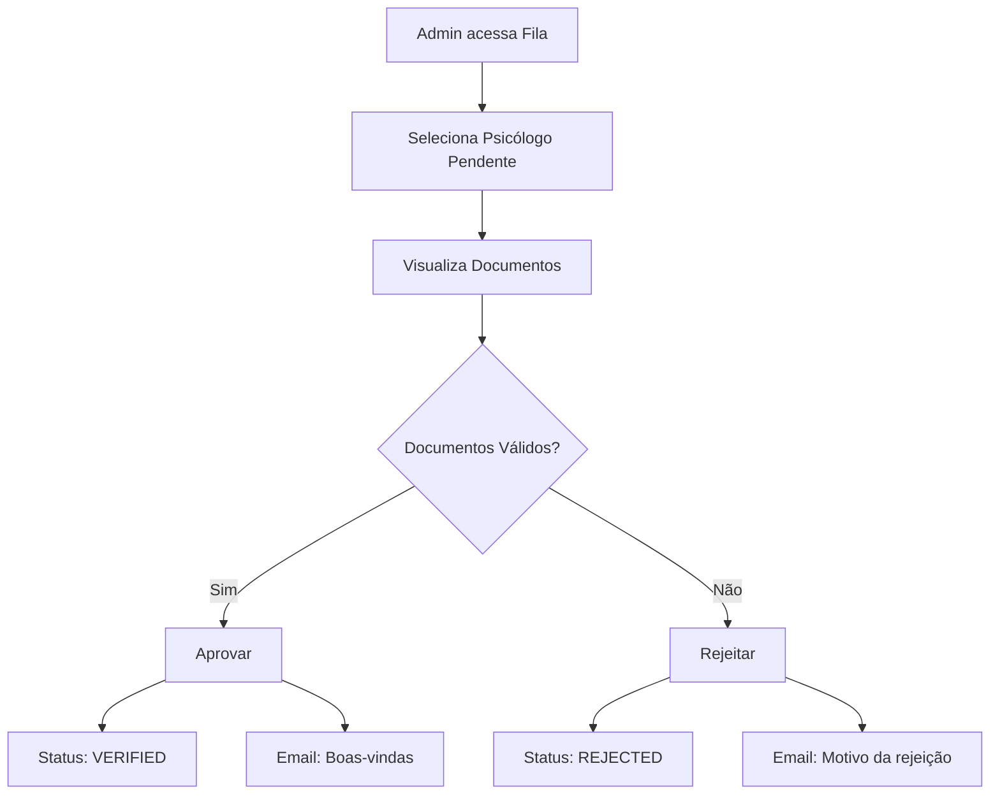

# Sitemap & Fluxos: Admin

## Sitemap do Painel Administrativo (`/admin`)

*   `/admin/dashboard` **Visão Geral** (KPIs da plataforma)
*   `/admin/verificacao` **Fila de Aprovação** (Psicólogos pendentes)
*   `/admin/usuarios` **Gestão de Usuários** (Bloquear/Desbloquear)

## Fluxos de Usuário

### 1. Fluxo de Aprovação

