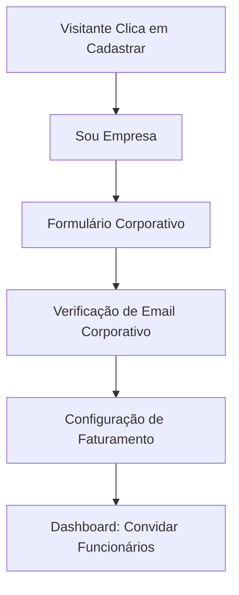

# Sitemap & Fluxos: Empresas

## Sitemap do Portal Corporativo (`/app/business`)

*   `/dashboard` **Visão Geral da Empresa** (Adoção, Sessões realizadas)
*   `/colaboradores` **Gestão de Vidas**
    *   `Adicionar` (Individual ou Bulk CSV upload)
    *   `Status` (Ativo/Pendente)
*   `/financeiro` **Faturamento** (Faturas, Método de pagamento da empresa)
*   `/relatorios` **BI de Saúde Mental** (Dados anonimizados de utilização)

## Fluxos de Usuário (Jornadas)

### 1. Fluxo de Cadastro Corporativo

