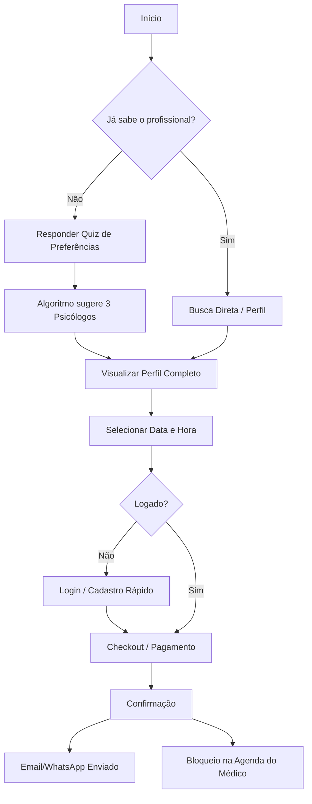
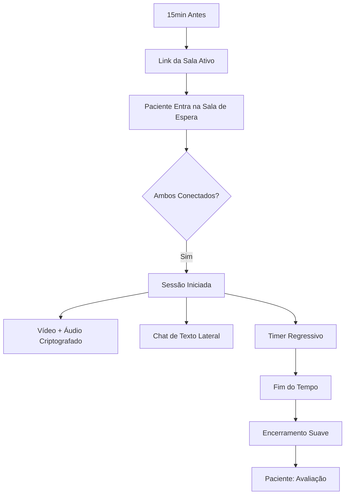
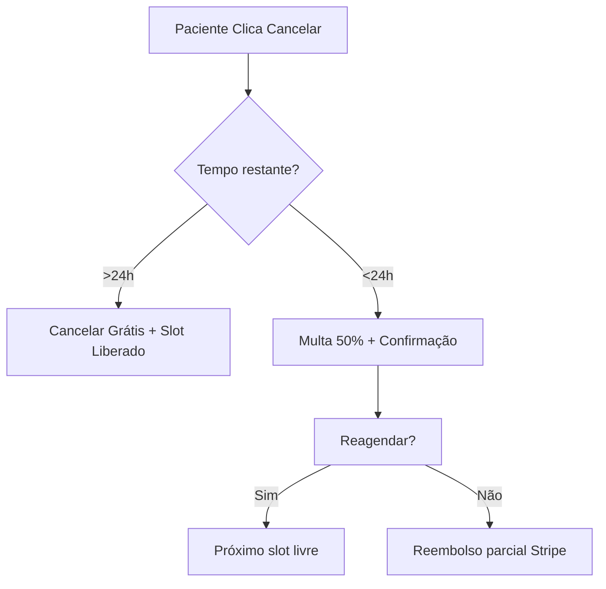

# Sitemap & Fluxos: Pacientes

## Sitemap do Portal do Paciente (`/app/patient`)

*   `/dashboard` **Visão Geral** (Próxima sessão, atalhos)
*   `/consultas` **Minhas Consultas**
    *   `/consultas/[id]` Detalhes, Link da Sala, Reagendar
*   `/consultas/nova` **Novo Agendamento** (Fluxo: Seleção -> Agenda -> Pagamento)
*   `/carteira` **Gestão Financeira** (Cartões salvos, Histórico de pagamentos)
*   `/perfil` **Configurações Pessoais**
*   `/sala/[id]` **Sala de Telemedicina** (Vídeo + Chat)
*   `/sala-espera/[id]` **Pré-atendimento** (Timer, Status do Psicólogo)
*   `/avaliacao/[id]` **Pós-sessão** (Rating ⭐ + Review)
*   `/reagendar/[id]` **Gestão de Conflitos**

## Fluxos de Usuário (Jornadas)

### 1. Jornada de Agendamento

### 2. Fluxo de Atendimento (Telemedicina)

### 3. Fluxo de Cancelamento

