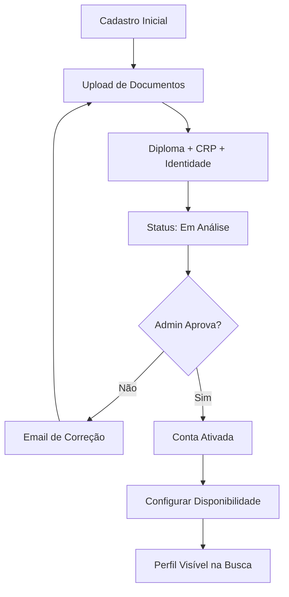
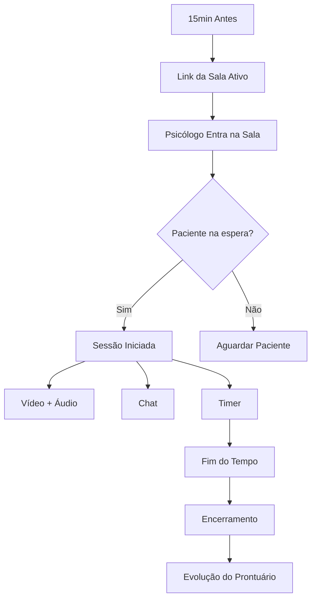

# Sitemap & Fluxos: Psicólogos

## Sitemap do Portal do Psicólogo (`/app/pro`)

*   `/dashboard` **Visão Geral** (Resumo do dia, Ganhos do mês)
*   `/agenda` **Gestão de Disponibilidade** (Configurar horários recorrentes/bloqueios)
*   `/pacientes` **CRM de Pacientes** (Lista, Histórico)
    *   `/pacientes/[id]` Prontuário, Anotações Privadas, Histórico de Sessões
*   `/mensagens` **Chat Seguro** (Comunicação assíncrona com pacientes)
*   `/financeiro` **Carteira Digital** (Saldo, Extrato, Solicitar Saque)
*   `/perfil` **Perfil Público** (Bio, Especialidades, Foto, Preço)
*   `/verificacao` **Status de Aprovação** (Envio de documentos CRP/Diploma)

## Fluxos de Usuário (Jornadas)

### 1. Jornada de Verificação

### 2. Fluxo de Atendimento (Visão do Profissional)

